# CDF-CDH Labs: Real-time sentiment analysis with NiFi, Kafka, Schema Registry, Streams Messaging Manager, Kudu, Impala and Hue.

--

### Objective

**The objective of this lab is to provide hands-on experience on Cloudera CDF, CDH (Kafka, Spark, Python, Kudu, Impala and Hue) through a single integrated workflow that brings all these components together in a single use-case.** 

For the purpose of this lab, we would build an end-to-end use case that will:

* *Ingest data sets from Meetup.com for a specific event through NiFi*
* *Parse the dataset and extract key terms from the data set, derive a sentiment rating with StanFord CoreNLP engine*
* *Configure NiFi with NiFi registry for Version Control*
* Configure Schema Registry for maintaining a schema version that all services will use as reference
* Configure Streaming Messaging Manager (SMM) to setup and manage Kafka Topics
* *Setup Kafka Topics to ingest data from NiFi*
* *Setup Kudu Tables to store the social data*
* *Leverage Spark, Python to read the data from Kafka and store it in Kudu*
* *Use Impala to run queries on Kudu*
* *Build a dashboard in Hue for better visualization of this dataset*

### Pre-requisites

You would require an environment where the following are installed and configured:

* Cloudera CDH (Impala, Kudu, Hue)
* Cloudera Data Flow (Nifi, Registry)

We provide instructions to deploy a single node CDH cluster with all the above pre-requisites configured and installed here: [Github Repo](https://github.com/fabiog1901/OneNodeCDHCluster)

Using this repo, you can bring up a CDH cluster with all components pre-installed (also includes CDSW deployment instructions as well). For specific cloudera workshops, we may provide an AMI image that can be launched without the need to install all components from scratch.

To prepare the environment:

* Deploy the OneNodeCluster using [Github Repo](https://github.com/fabiog1901/OneNodeCDHCluster). This OneNodeCluster Github repo was built by my colleague [**Fabio Ghirardello**](https://github.com/fabiog1901), who put in a lot of effort to have a single CDSW+CDH+CDF instance that can be leveraged for end-to-end demos and labs.  The deployment takes <30 mins for a built-from-scratch environment.

--

## Content

* [Lab 1 - Accessing the sandbox](#accessing-the-sandbox)
* [Lab 2 - Preparing your instance for labs](#preparing-your-instance-for-labs)
* [Lab 3 - Stream data using NiFi](#stream-data-using-nifi)
* [Lab 4 - Creating and Registering Schema in Schema Registry](#creating-and-registering-schema-in-schema-registry)
* [Lab 5 - Using Streams Messaging Manager to create and manage Kafka Topics](#using-streams-messaging-manager-to-create-and-manage-kafka-topics)
* [Lab 6 - Enhance NiFi flow to identify sentiment on comments](#enhance-nifi-flow-to-identify-sentiment-on-comments)
* [Lab 7 - Incorporating Schema Registry in the NiFi flow](#incorporating-schema-registry-in-the-nifi-flow)
* [Lab 8 - Using SMM to track messages in Kafka](#using-smm-to-track-messages-in-kafka)
* [Lab 9 - Configuring Kudu and Impala](#configuring-kudu-and-impala)
* [Lab 10 - Using NiFi to populate data from Kafka to Kudu](#using-nifi-to-populate-data-from-kafka-to-kudu)
* [Lab 11 - Use Impala to query Kudu](#use-impala-to-query-kudu)
* [Lab 12 - Configure Hue](#configure-hue)
* [Lab 13 - Build Dashboard with Hue](#build-dashboard-with-hue)


## Accessing the sandbox

### SSH to the sandbox

If you are using mac, then open terminal and navigate to the directory where you have downloaded the .pem file and execute the following:

	$ chmod 400 sg-cdf-cdp-cdsw-workshop.pem

Then you can ssh by typing (Public IP to be provided by Cloudera):

	$ ssh -i sg-cdf-cdp-cdsw-workshop.pem centos@public_ip_of_instance

On Mac use the terminal to SSH

On Windows use [putty](https://www.chiark.greenend.org.uk/~sgtatham/putty/latest.html)

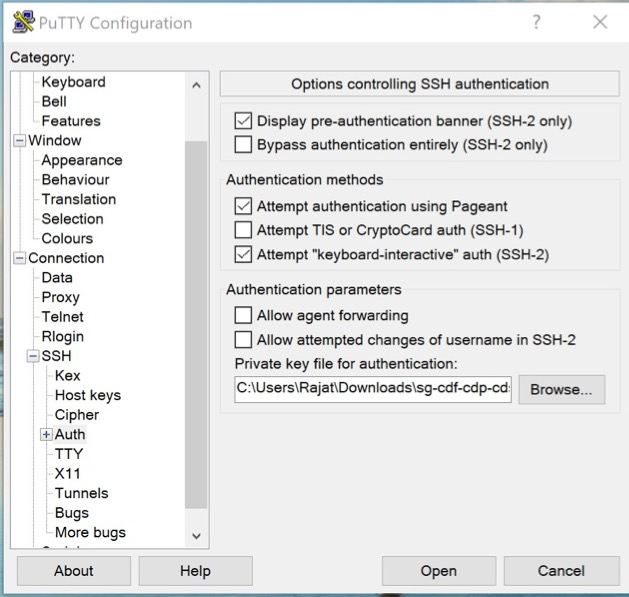

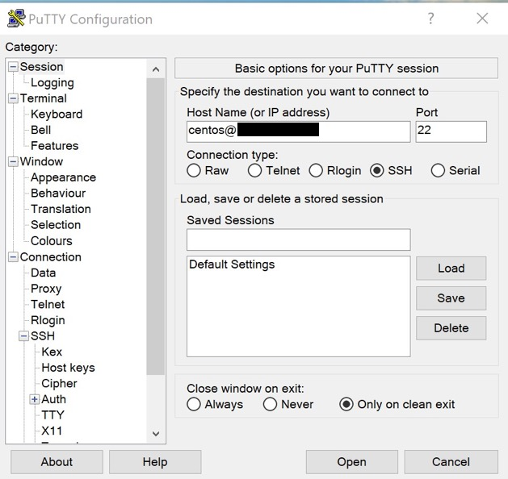


In the event you don't have local installation rights, the easiest option is **[Google Secure Shell](https://chrome.google.com/webstore/detail/secure-shell/pnhechapfaindjhompbnflcldabbghjo?hl=en)**.

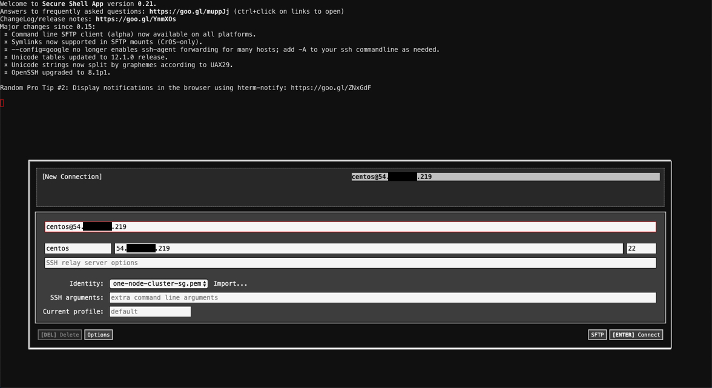

**Important: Before you start with the lab exercises, and if you are using AWS/Azure/Google instance for running this OneNodeCluster, then please ensure that you have opened the following ports (inbound) to your laptop IP.** 

```
80, 8080, 9999, 22, 7180, 7788, 9991, 10080, 18080
```

**Some of these ports are also being used by the services to interoperate. Please ensure that you have also opened these ports towards (inbound) your PUBLIC_IP of the instance, in addition to your laptop. If you are doing this in a Cloudera workshop conducted by a Solutions Architect, then this would be addressed by the instructor.** 

[Back to Index](#content)

--

### Accessing Cloudera Manager

The following services are going to be installed, but initially only Cloudera Manager would be accessible as by default all services would be in shutdown state. 

- Cloudera Manager : http://YOUR_PUBLIC_IP:7180
- NiFI : http://YOUR_PUBLIC_IP:8080/nifi
- NiFi Registry: http://YOUR_PUBLIC_IP:18080/nifi-registry
- Schema Registry: http://YOUR_PUBLIC_IP:7788/
- Streams Messaging Manager: http://YOUR_PUBLIC_IP:9991/
- HUE: http://YOUR_PUBLIC_IP:8888

Login to **Cloudera Manager** with username/password ```admin/admin```, and familiarize yourself with all the services installed.  For the first startup, especially for CDSW, it could take up to 20 mins. 

**After a successful startup, all services would be showing a green tick.**

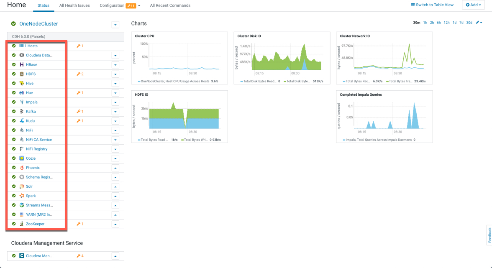

[Back to Index](#content)

--

## Preparing your instance for labs

There are a few configuration files and scripts that need to be downloaded in your instance, before we can start with the labs. A summary of these is as follows:

* Install Unzip
* Download Standford NLB package - [CoreNLP - Natural language software](https://stanfordnlp.github.io/CoreNLP/)
* Unzip the Stanford NLP package
* Download Kudu Spark Jar file
* Download Spark Core Jar file
* Download all scripts needed for labs and setup execute permission

The above setup has been provided in a script that you can download from here by issueing the following command in terminal/putty:

	$ wget https://raw.githubusercontent.com/rajatrakesh/CDF-CDH-Workshop/master/scripts/config_lab.sh
	$ chmod +x config_lab.sh
	$ ./config_lab.sh

This script would download/setup all the above required dependencies and will also download a bunch of housekeeping scripts that we would use during the labs. These would be available in the home folder as well. (/home/centos)

[Back to Index](#content)

--

## Stream data using NiFi

### Run the sentiment analysis model

For the purpose of this exercise we are not going to train, test and implement a classification model but re-use an existing sentiment analysis model, provided by the Stanford University as part of their 

The Stanford NLP Engine would be setup in the directory ```/home/centos/stanford-corenlp-full-2018-10-05```

The NLP engine would have been automatically started. (The script `start_nlp_engine.sh` starts this manually, only required if you are troubleshooting). 


Details on the corenlp server are available here [Stanford NLP](https://stanfordnlp.github.io/CoreNLP/corenlp-server.html)

The NLP Engine will run in the background on port 9999 and you can visit the http://YOUR_PUBLIC_IP:9999 to make sure it's running.

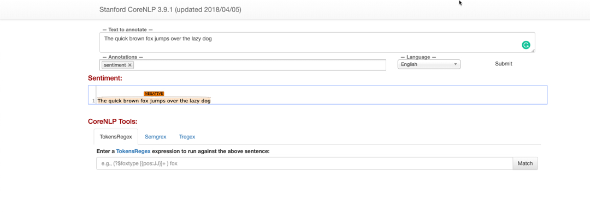

To test out the engine, remove all annotations and use **Sentiment** only. 

The model will classify the given text into 5 categories:

- very negative
- negative
- neutral
- positive
- very positive

[Back to Index](#content)

--

### Build NiFi flow

In order to have a streaming source available for our workshop, we are going to make use of the publicly available Meetup.com API and connect to their WebSocket.

The API documentation is available [here](https://www.meetup.com/meetup_api/docs/stream/2/event_comments/#websockets).

In this scenario we are going to stream all comments, for all topics, into NiFi and classify each one of them into the 5 categories listed above. 

To do that we need to score each comment's content against the Stanford CoreNLP's sentiment model. 

In real-world use case we would probably filter by event of our interest but for the sake of this workshop we won't and assume all comments are given for the same event: the famous CDF workshop!

Let's get started... Open the **NiFi UI** at http://YOUR_PUBLIC_IP:8080/nifi and follow the steps below:

- **Step 1: Adding a Processor Group**
	- Drag the Processor Group to the Canvas and give it a name 'CDF Workshop'. 
	- Click Add.
	- Double click the Processor Group and it will show up a blank canvas (inside the group).

	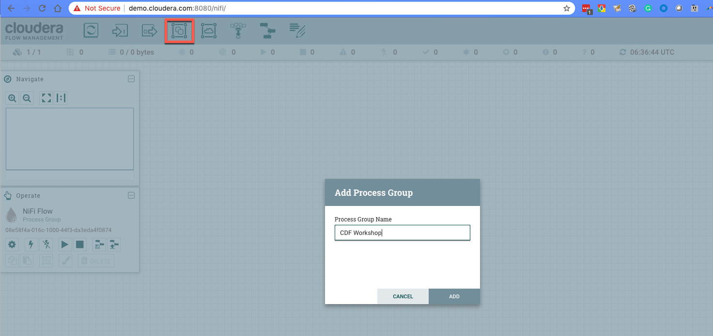

- **Step 2: Enabling Nifi Registry**
	- Open the **NiFi Registry** Portal at http://YOUR_PUBLIC_IP:18080/nifi-registry
	
	
	
	- Let's add a bucket. Click the wrench icon in the right corner to open up the Bucket screen.
	- Let's create a new bucket and call it ```workshop```.
	
	

	- We need to connect Nifi with Nifi Registry. Click the three hortizontal bar icon in the right top corner. Then click 'Controller Settigs'
	
	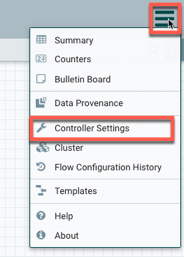
	
	- Let's create a new registration for the client. **Note For this option to work, you would need to open the port 18080, to not just your public IP (computer), but also the public IP of your instance.**

	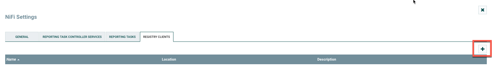
	
	- Add the url of Nifi Registry and click update.
	
	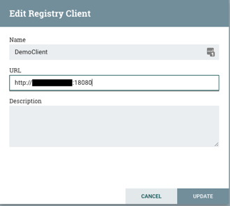
	
	- Right click anywhere on the Nifi canvas and select 'Refresh' in the menu.
	- Right click again and this time select 'Version' -> 'Start Version Control'.
	
	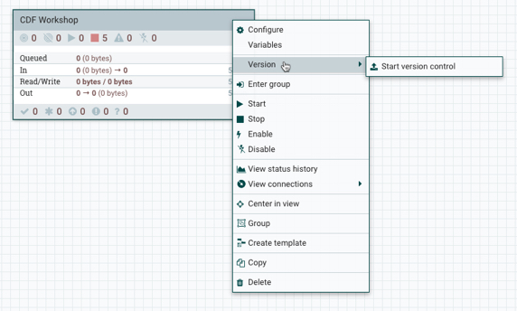
	
	- If everything is setup correctly, your bucket created earlier should get autoselected (being the only bucket).
	- Provide a name for the Flow - ```CDF Workshop``` for example. 
	- You can also provide a description for your flow. 
	- Click Save.
	
	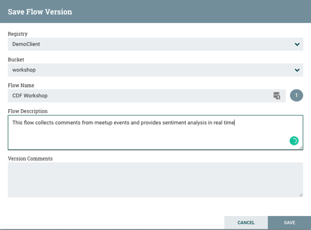
	
	- A green tick will appear on your Processor Group indicating that your flow now has versipon control enabled. 
	
	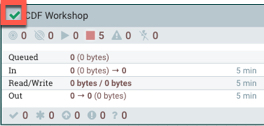

- **Step 3: Add a ConnectWebSocket processor to the canvas**
 	 - Double click on the processor
 	 - On settings tab, check all relationships except **text message**, as we want only a text message to go forward to subsequent flow. 

 	 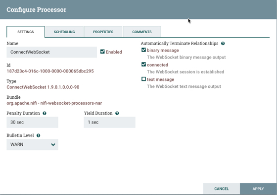
 	 
 	 - Got to properties tab and select or create **JettyWebSocketClient** as the WebSocket Client Controller Service
 	 - Go to properties tab and give a value to **WebSocket Client Id** such as ```demo``` for example

 	 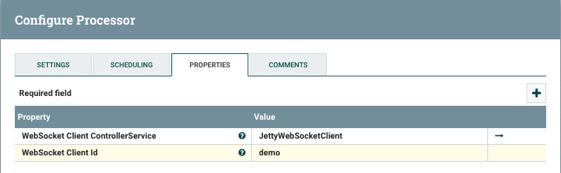  
 	 
 	 - Then configure the service (click on the arrow on the right)
 	 - Go to properties tab and add this value: ```ws://stream.meetup.com/2/event_comments``` to property **WebSocket URI**
 	 - Apply the change
 	 - Enable the controller service (click on the thunder icon) and close the window
 	 - Apply changes

 
- **Step 4: Add an UpdateAttribute connector to the canvas**
	- Double click to open the processor. 
	- On properties tab add new property mime.type clicking on + icon and give the value ```application/json```. This will tell the next processor that the messages sent by the Meetup WebSocket is in JSON format.
	- Add another property ```event``` and give it a value ```CDF workshop``` for the purpose of this exercise.
	- Apply changes.
	
	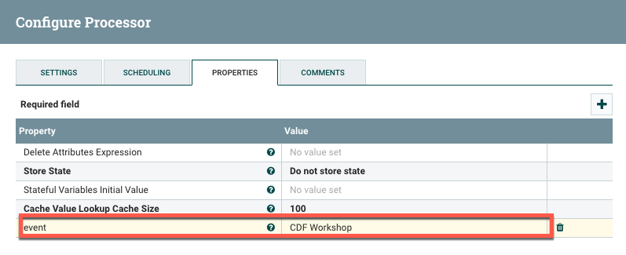

- **Step 5: Link ConnectWebSocket with UpdataAttribute processor**
	- Hover the mouse on the **ConnectWebSocket** processor and a link icon will appear
	
	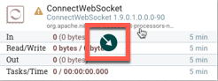 
	
	- Drag and link this to the **UpdateAttribute** processor (green link will appear)
	
	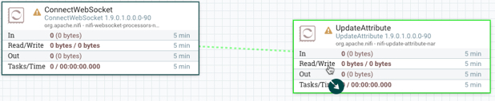
	
	- A property box will open up. 
	- Select only **text message**
	
	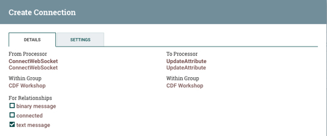
	
	- The two processors are now linked
	
	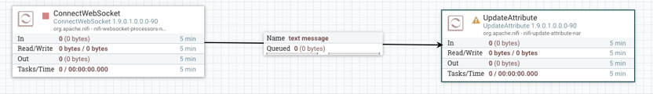

- **Step 6: Add EvaluateJsonPath processor to the canvas**
	- Double click the processor.
	- On Settings tab, select both **failure** and **unmatached** relationships
	- On properties tab, change **Destination** value to **flowfile-attribute**.
	- Add the following properties:
		- timestamp: ```$.mtime```
		- member: ```$.member.member_name```
		- country: ```$.group.country```
		- message_comment: ```$.comment```
	- The message coming out of the processor would look like this:

	```
	{"visibility":"public","member":{"member_id":11643711,"photo":"https:\/\/secure.meetupstatic.com\/photos\/member\/3\/1\/6\/8\/thumb_273072648.jpeg","member_name":"Loka Murphy"},"comment":"I didn’t when I registered but now thinking I want to try and get one since it’s only taking place once.","id":-259414201,"mtime":1541557753087,"event":{"event_name":"Tunnel to Viaduct 8k Run","event_id":"256109695"},"table_name":"event_comment","group":{"join_mode":"open","country":"us","city":"Seattle","name":"Seattle Green Lake Running Group","group_lon":-122.34,"id":1608555,"state":"WA","urlname":"Seattle-Greenlake-Running-Group","category":{"name":"fitness","id":9,"shortname":"fitness"},"group_photo":{"highres_link":"https:\/\/secure.meetupstatic.com\/photos\/event\/9\/e\/f\/4\/highres_465640692.jpeg","photo_link":"https:\/\/secure.meetupstatic.com\/photos\/event\/9\/e\/f\/4\/600_465640692.jpeg","photo_id":465640692,"thumb_link":"https:\/\/secure.meetupstatic.com\/photos\/event\/9\/e\/f\/4\/thumb_465640692.jpeg"},"group_lat":47.61},"in_reply_to":496130460,"status":"active"}
	```

	- Link EvaluateJsonPath to UpdateAttribute processor 
	
- **Step 7: Add a AttributesToCSV processor to the canvas**
	- Double click to open the processor. 
	- On settings tab, select **failure** relationship
	- Change **Destination** value to **flowfile-content**
	- Change **Attribute List** value to write only the above parsed attributes: **timestamp,event,member,country,message_comment**
	- Set **Include Schema** to **true**
	- Apply changes
	- Link AttributesToCSV with EvaluateJsonPath on **matched** relationship

- **Step 8: Add a PutFile processor to the canvas**
	- Open the processor.
	- On settings tab, select **all** relationships - Since this will be the last connector in this flow, we need to terminate all relationships. 
	- Change **Directory** value to ```/tmp/workshop```
	- Link PutFile process with AttributesToCSV processor on **success** relationship.
	- Apply Changes.

- **Step 9: Commit your first Flow**
	- Right click anywhere on the canvas.
	- Click 'Version' -> 'Commit Local Changes'.
	
	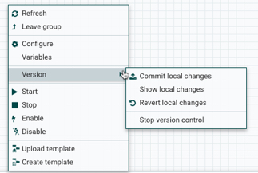.
	
	- Provide commentary for your Version.
	
	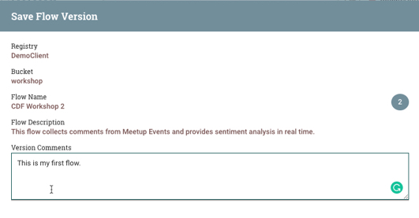.
	
	- Now goto Nifi Registry and you would be able to see the version information show up here as well. 
	
	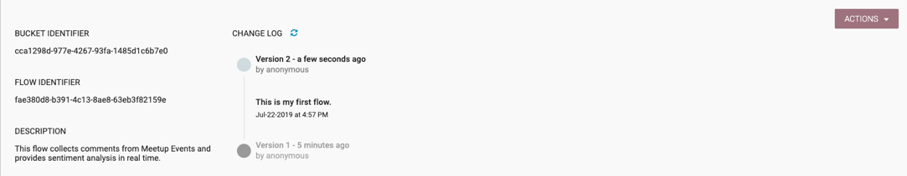.

- **Step 10: Start your First Flow**
	- Click the Play icon on the 'CDF Workshop' Processor Group to start the entire flow. 
	- All the processors will now show a green play icon, as the processor start to execute. 
	- You will see flow-files starting to move and you can gradually see how the data is being read from meetup.com
	
	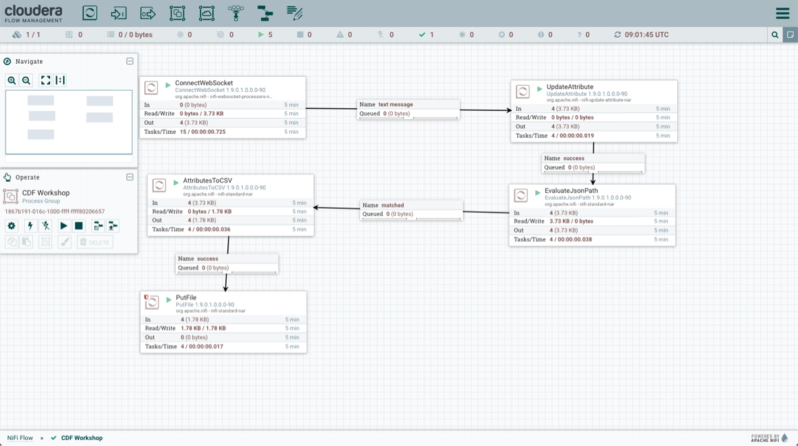.
	
	- **Optional**:  To review the actual files being written, ssh to your instance and navigate to the ```/tmp/workshop``` directory.
	- You will see all the files being written here. You can select any one of them and issue a ```cat <filename>``` command to view the contents as well. 
	
	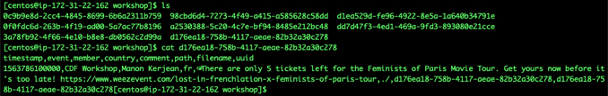.
	
	- Once done, stop the flow and delete the files created by this flow by typing:
		
		```sudo rm -rf /tmp/workshop/*```

[Back to Index](#content)

--

## Creating and Registering Schema in Schema Registry

- The data produced in the NiFi flow is descibed in the schema file sentiment.avsc. In this lab, we will register this schema in the Schema Registy so that our flows in NiFi can refer to schema using an unified service. This will also allow us to evolve and update our schema in the future, if needed, keeping older versions under control so that existing flows and flowfiles will continue to work. 

- To configure Schema Registry, go to the following URL, which contains the schema definition that we will be using for this lab. 

  https://raw.githubusercontent.com/rajatrakesh/CDF-CDH-Workshop/master/sentiment.avsc

- Access Schema Registry at: http://YOUR_PUBLIC_IP:7788

- In the Schema Registry UI, click the + sign to register a new schema.

- Click on Schema Text field and paste the contents that you have copied from the file above. 

- Complete the schema creation by filling in the following properties:

  ```
  Name: 				 SentimentAnalysis
  Description:	 Schema for data generated by Meetup
  Type: 				 Avro Schema Reader
  Schema Group:	 Kafk
  Compatibility: Backward
  Evolve: 			 checked
  ```

  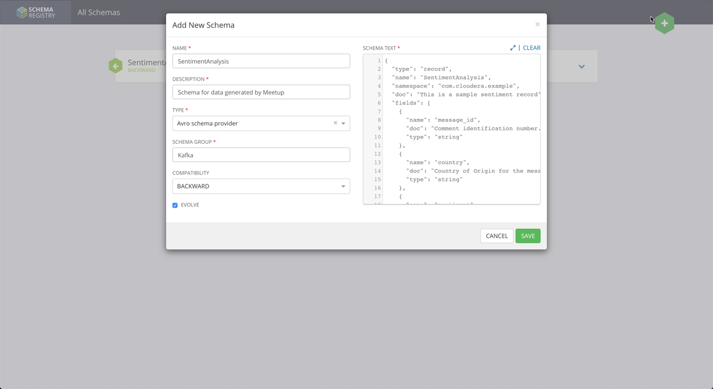

- Save the schema.

- Now let's enable the processors in our Process Group to use schemas stored in Schema Registry. Right-click on the Process Group, select **Configure** and navigate to the **Contoller Services** tab. Click the + icon and add a **HortonworksSchemaRegistry** service.

  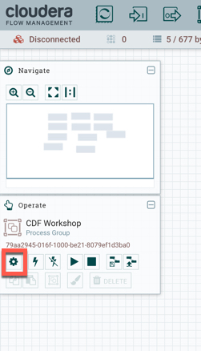

- After the service is added, click the service's cog icon, and goto the **Properties** tab and configure it with the following **Schema Registry URL** and click **Apply**.

  ```
  URL: http://YOUR_PUBLIC_IP:7788/api/v1
  ```

  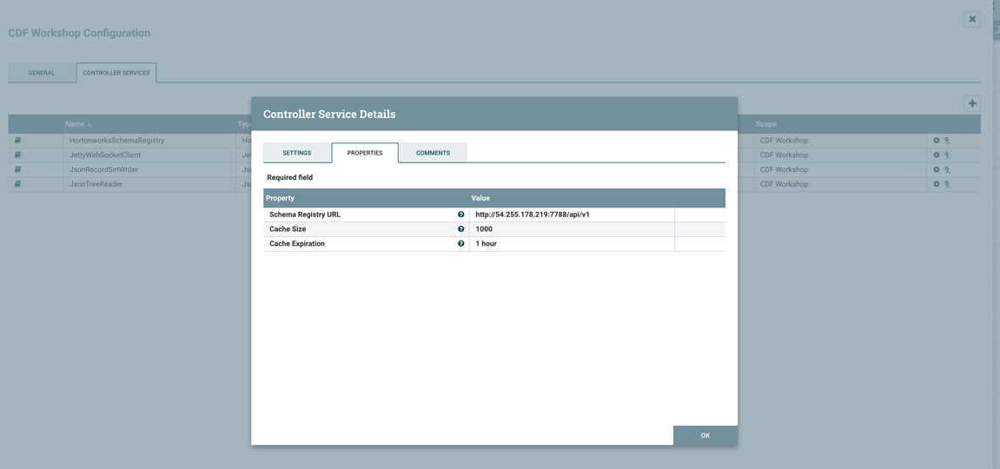

- Click on the lighting bolt icon to **enable** the **HortonworksSchemaRegistry** Controller Service. 

- Still on the **Controller Services** screen, let's add two additional services to handle the reading and writing of JSON records. This will let NiFi connect to Schema Registry and access the Schema we created earlier. Click the + button and add the following two services:

- **`JsonTreeReader`**, with the following properties:

  ```
  Schema Access Strategy: Use 'Schema Name' Property
  Schema Registry: 		HortonworksSchemaRegistry
  Schema Name: 		${schema.name} -> already set by default
  ```

  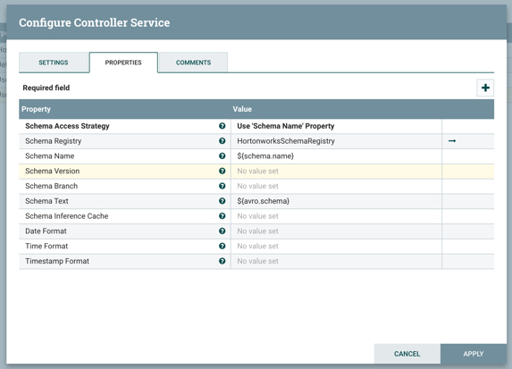

- **`JsonRecordSetWriter`**, with the following properties:

  ```
  Schema Write Strategy:  HWX Schema Reference Attributes
  Schema Access Strategy: Inherit Record Schema
  Schema Registry:     HortonworksSchemaRegistry
  ```

  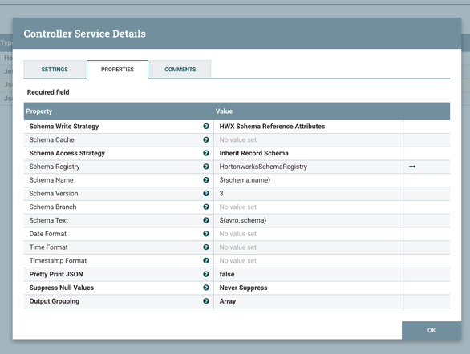

- Enable the **`JsonTreeReader`** and the **`JsonRecordSetWriter`** Controller Services you just created, by clicking on their respective *lightning bolt* icons.

- If you have setup all services, the Controller Services screen for the Process Group would look as follows:

  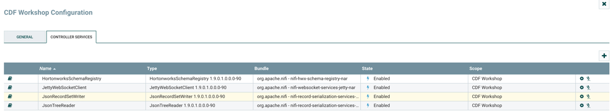

## Using Streams Messaging Manager to create and manage Kafka Topics

- **Accessing SMM**
	
	- SMM Web UI is accessible at: http://YOUR_PUBLIC_IP:9991
	
	  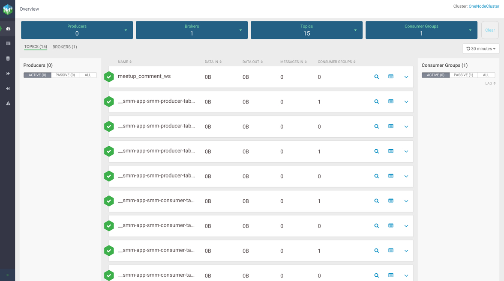
	
	- Familiarize yourself with the options there, esp the filters (green boxes) at the top of the screen.
	
	- The first thing we need to is create a new topic, where we would be sending our data to. Click the third icon on the left in the toolbar (on hovering, it will read 'Topics')
	
	  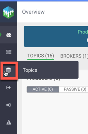
	
	- This screen lists all the topics that SMM is tracking. Let's create a new topic. Click the 'Add New' button on the right top corner of the screen. 
	
	  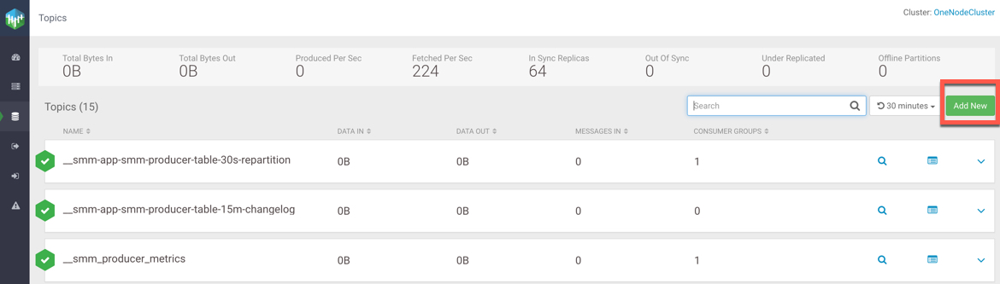
	
	- In the pop-up screen that opens, select 'Low' option for Availability. Since we are running a singlenodecluster, we don't have replication setup for Kafka, hence we will choose this option. 
	
	- Configure the properties on the screen as follows:
	
	  ```
	  Topic Name: 			meetup_comment_ws
	  Partitions: 			1
	  Availability:			Low 
	  Limits:				delete (cleanup policy)
	  ```
	
	  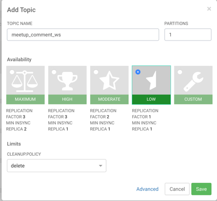
	
	- Click Save.
	
	- Currently we are not writing anything to our topic. Any active topics are highlighted as 'Active' on the 'Overview' page. 
	
	- We will revisit SMM once we finish the NiFi flow. 
	

[Back to Index](#content)

--

## Enhance NiFi Flow to identify sentiment on comments

Go back to [NiFi UI](http://demo.cloudera.com:9090/nifi/) and follow the steps below:

- **Step 1: Remove EvaluateJson and AttributesToCSV processorsw**
  - Right click on the relationship between EvaluateJsonPath and AttibutesToCSV processors and delete
  - Delete the AttibutesToCSV processor
  - Do the same for the PutFile processor
  
- **Step 2: Parse content through the sentiment engine to derive sentiment**
  - Add ReplaceText processor and link from EvaluateJSonPath on **matched** relationship
  - Double click on processor and check **failure** on settings tab
  - Go to properties tab and remove value for **Search Value** and set it to empty string
  - Set **Replacement Value** with value: ```${message_comment:replaceAll('\\.', ';')}```. We want to make sure the entire comment is evaluated as one sentence instead of one evaluation per sentence within the same comment.
  - Set **Replacement Strategy** to **Always Replace**
  - Apply changes

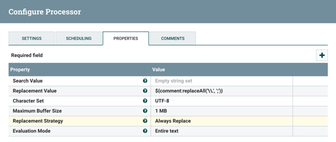

- **Step 3: Invoke the Sentiment engine through InvokeHTTP processor**
  - Add InvokeHTTP processor and link from ReplaceText on **success** relationship
  - Double click on processor and check all relationships except **Response** on settings tab
  - Go to properties tab and set value for **HTTP Method** to **POST**
  - Set **Remote URL** with value: ```http://YOUR_PUBLIC_IP:9999/?properties=%7B%22annotators%22%3A%22sentiment%22%2C%22outputFormat%22%3A%22json%22%7D``` 
  - **Make sure you have used the encoded URL and that you have replaced 'YOUR_PUBLIC_IP' with your actual IP**
  - Set **Content-Type** to ```application/x-www-form-urlencoded```
  - Apply changes

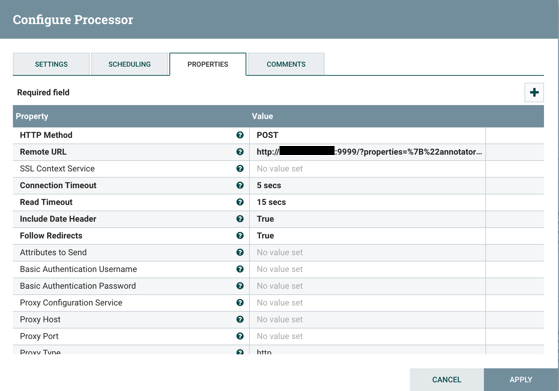

- **Step 4: Add EvalueJsonPath processor to process sentiment**
  - Add EvaluateJsonPath to the canvas and link from InvokeHTTP on **Response** relationship
  - Double click on the processor
  - On settings tab, check both **failure** and **unmatched** relationships
  - On properties tab
  - Change **Destination** value to **flowfile-attribute**
  - Add on the property **sentiment** with value ```$.sentences[0].sentiment```
  - Apply changes

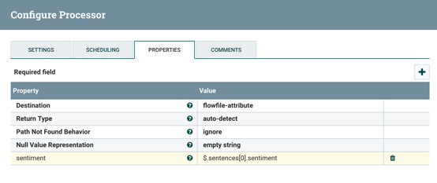

- **Step 5: Format time [ISO format](https://en.wikipedia.org/wiki/ISO_8601) with UpdateAttribute processor (future use for time based analytics)**
  - Add UpdateAttribute processor and link from EvaluateJsonPath on **matched** relationship
  - Using handy [NiFi's language expression](https://nifi.apache.org/docs/nifi-docs/html/expression-language-guide.html#dates), add a new attribue ```dateandtime``` with value: ```${timestamp:format("yyyy-MM-dd'T'HH:mm:ss'Z'", "Asia/Singapore")}``` to properties tab.
  - Add another property `message_id` with value: `${uuid}`

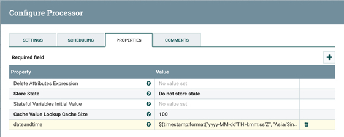

- **Step 6: Prepare attributes list that will be pushed to Kafka with AttributesToJSON processor**
  - Add AttributesToJSON Processor.
  - Link with UpdateAttribute on **success**.
  - Double click on processor
  - On settings tab, check **failure** relationship
  - Go to properties tab
  - In the Attributes List value set `dateandtime, country, event, member, sentiment, message_comment, message_id`. We will match this structure later in the table that we will create in Kudu.
  - Change Destination to **flowfile-content**
  - Set Include Core Attributes to **false**
  - Apply changes

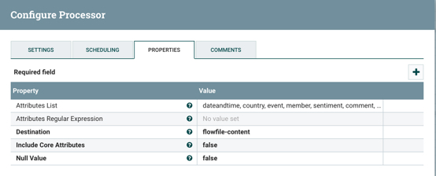

## Incorporating Schema Registry in the NiFi flow

- **Defining Schema Name**

  - We need to tell NiFi which schema should be used to read and right the Message data. For this, we'll use an UpdateAttribute processor to add an attribute to the FlowFile indicating the schema name. 

  - Add an UpdateAttribute processor by dragging the processor icon to the canvas.

  - Double-click the UpdateAttribute processor and configure the as follows:

  - In the Properties tab, click the + button and add the following properties:

    ```
    Property Name:		schema.name
    Property Value: 	SentimentAnalysis
    ```

    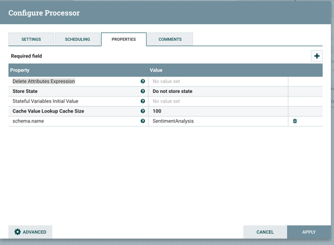

  - Click **Apply**.

  - Connect the AttributesToJSON processor to UpdateAttribute Processor on success.

- **Push the data to Kafka**
  
  - Add **PublishKafkaRecord_2 _0** to the canvas and link from previous **UpdateAttribute** on **success** relationship. Double click on the processor.
  
  - On the settings tab, select both failure and success for Automatically Terminate Relationships.
  
  - On the properties tab, we need to configure the following:
  
     ```
     Kafka Brokers:                         			kafka_broker_ip:9092
     Topic Name:                            			meetup_comment_ws
     Record Reader:                         			JsonTreeReader
     Record Writer:                         			JsonRecordSetWriter
     Use Transactions:                      			false
     Attributes to Send as Headers (Regex): 			schema.*
     ```
  
  - Make sure you use the PublishKafkaRecord_2.0 processor and **not** the PublishKafka_2.0
  
  		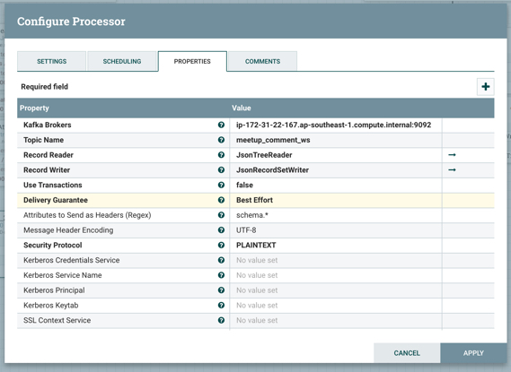
  
  - While still in the *PROPERTIES* tab of the ***PublishKafkaRecord_2.0*** processor, click on the (+) button and add the following property:
  
     ```
     Property Name:  client.id
     Property Value: nifi-meetup-data
     ```
  
  - The above property will help us clearly identify who is producing data into the Kafka topic.
  
  - Click **Apply**.
  
  - Your canvas should look as follows:
  
     
  
     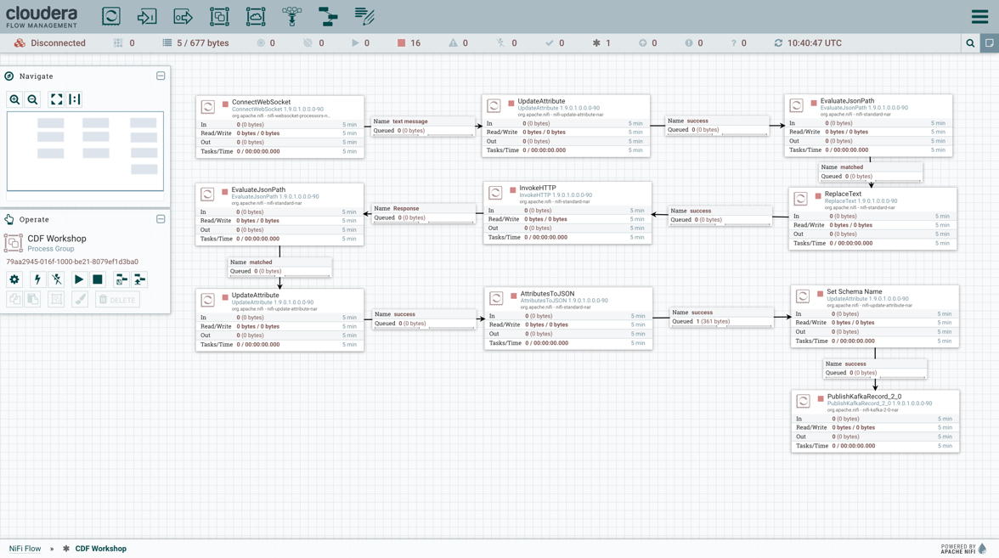
  
  

[Back to Index](#content)

--

## Using SMM to track messages in Kafka

- Let's start our NiFi Process Group, by click the play button on the Process Group. For tracking, you can also choose to start each processor one-by-one. This will provide clarity into how the flow file changes throughout the NiFi flow. 

- Once the NiFi flow is started, you will see that messages will start to flow into Kafka. 

  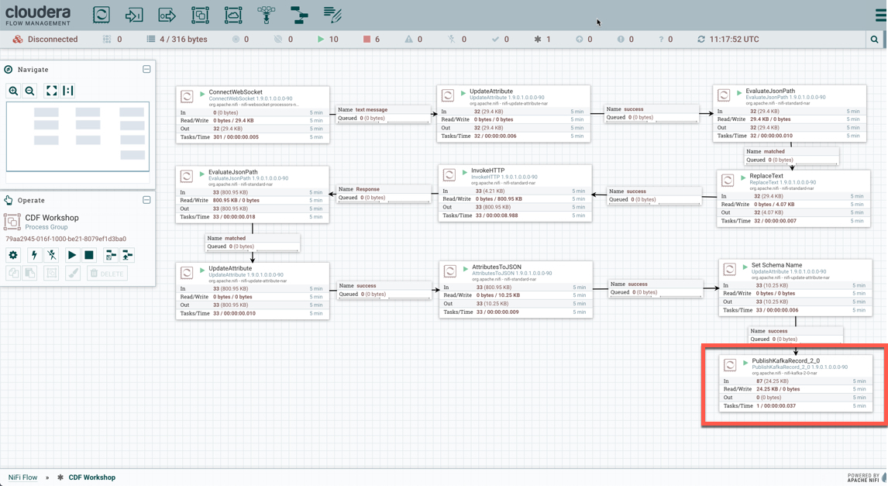

- Click on the **Producers** filter and select only the **`nifi-sentiment-data`** producer. 

- If you filter by **Topic** instead and select the `meetup_comment_ws` topic, you’ll be able to see all the **producers** and **consumers** that are writing to and reading from it, respectively. Since we haven’t implemented any consumers yet, the consumer list should be empty.

  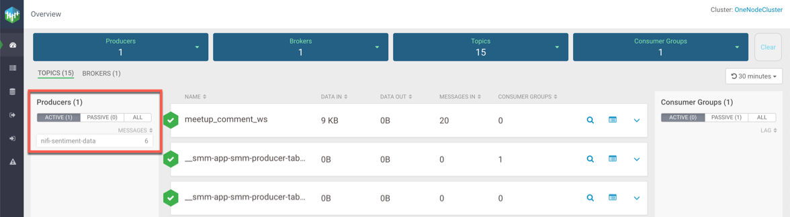

- Click on the topic to explore its details. You can see more details, metrics and the break down per partition. Click on one of the partitions and you’ll see additional information and which producers and consumers interact with that partition.

  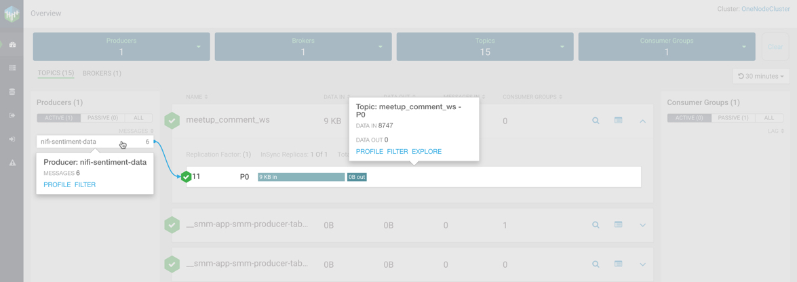

- Click on the **EXPLORE** link to visualize the data in a particular partition. Confirm that there’s data in the Kafka topic and it looks like the JSON produced by NiFi.

  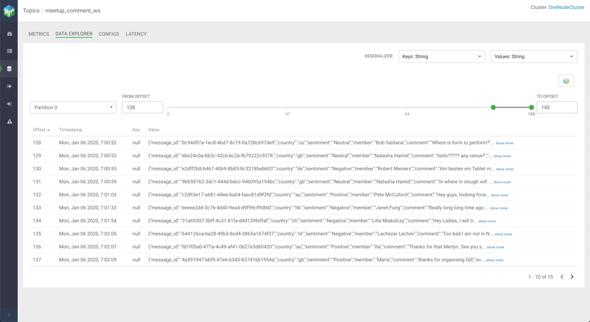

- Every message has a 'show more'. Clicking that shows the full message coming in. You would notice that the schema is being picked up from Schema Registry. 

  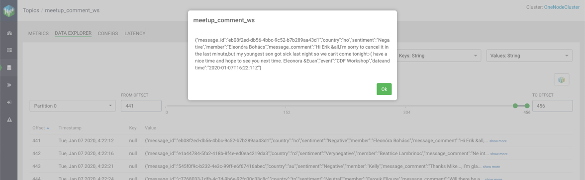

- Once you see that messages are starting to flow into Kafka, you can stop your CDF flow. We will start it again later once we have setup a table in Kudu and Impala. 

## Configure Kudu and Impala

We will now setup a Kudu table with the same schema that we are using in Step 6 above. The steps are as follows:

- Connect to Hue. We will be using Hue as our query client to create and access table, with Impala. To connect to Hue, click the [Hue](demo.cloudera.com:8888) URL.

  **Important: Since we would be accessing Hue for the first time, the first user to access it will become the Hue Admin**

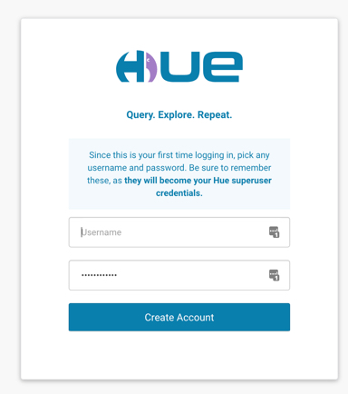

- Let's use admin/admin as the userid/password for Hue.
- Before you create the tables, confirm that Kudu service is running (using Cloudera Manager)

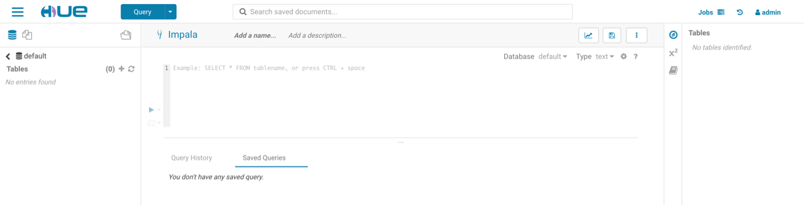

- Execute the following query in the Impala query console

   ```
   CREATE TABLE meetup_comment_sentiment
   	(
   	message_id string,
   	dateandtime string,
   	country string,
   	event string,
   	member string,
   	sentiment string,
   	message_comment string,
   	 PRIMARY KEY (message_id)
   	)
   	PARTITION BY HASH PARTITIONS 10
   	STORED AS KUDU
   	TBLPROPERTIES ('kudu.num_tablet_replicas' = '1');
   ```

- Click the blue 'Play' button on the left. You will get a confirmation that the table has been created. 

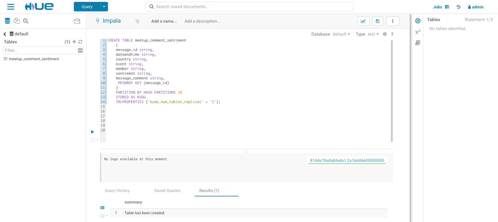

[Back to Index](#content)

--

## Using NiFi to populate the date from Kafka to Kudu

When the meetup data was sent to Kafka using the *PublishKafkaRecord* processor, we chose to attach the schema information in the header of Kafka messages. Now, instead of hard-coding which schema we should use to read the message, we can leverage that metadata to dynamically load the correct schema for each message.

- Let's start by creating a new flow to the same canvas that we were using before (inside the same Process Group).
	
- Add a ConsumeKafkaRecord_2_0 processor to the canvas and configure it as follows:
	
- Properties:
	
	```
	Kafka Broker: 	internal_ip: 9092
	Topic Name(s):	meetup_comment_ws
	Topic Name Format:	names
	Record Reader:	JsonTreeReader
	Record Writer:	JsonRecordSetWriter
	Honor Transactions:	false
	Group ID:		nifi-message-consumer
	Offset Reset:	latest
	Headers to Add as attributes (Regex):		schema.*
	```
	
	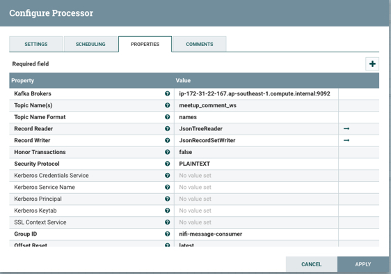
	
- Add a PutKudu processor to the canvas and configure it as follows:
	
- Properties:
	
	```
	Kudu Masters:	internal_ip:7051
	Table Name:	impala::default.meetup_comment_sentiment
	Record Reader: JsonTreeReader
	```
	
	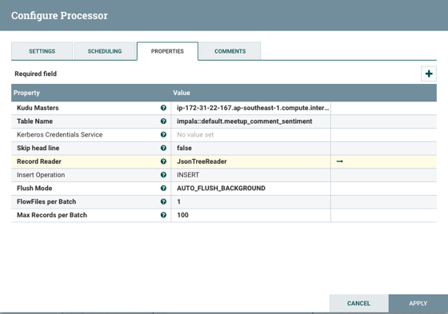
	
- Connect the **ConsumeKafkaRecord_2_0** processor to the **PutKudu** one. When prompted, check the **success** relationship for this connection.
	
- Double-click on the **PutKudu** processor, go to the **SETTINGS** tab, check the "**success**" relationship in the **AUTOMATICALLY TERMINATED RELATIONSHIPS** section. Click **Apply**.

- This section looks as follows:

   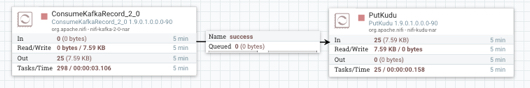

[Back to Index](#content)

--

## Use Impala to query Kudu

- With the spark job running, let's validate that data is being written to our Kudu table. 
- Access Hue and navigate to the Impala Query. 
- Execute the following query: 

		select count(*) from meetup_comment_sentiment;
	
- If you execute this query a few times, you would be able to see records getting populated into your table. 

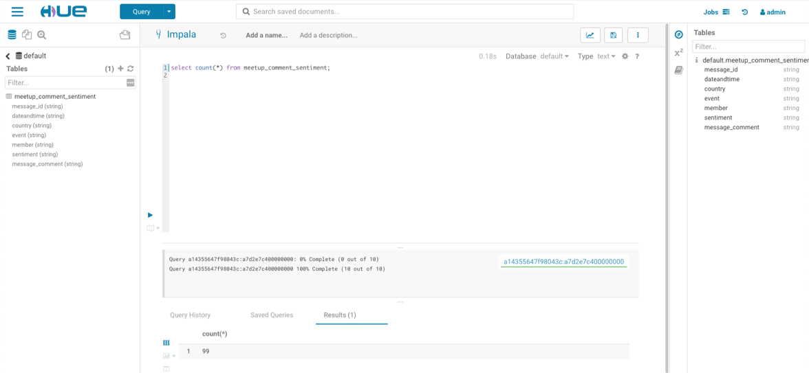

- Let's also check the values of columns. For this, we advise that you use a ```limit``` parameter, if executing a ```select *``` statement, as follows:

		select * from meetup_comment_sentiment limit 10;

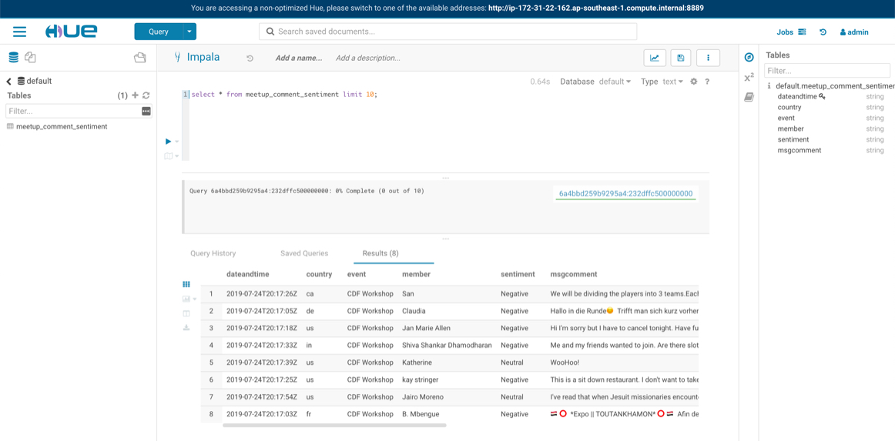

- We can see that data is coming in all the columns that we had setup. 

[Back to Index](#content)

--

## Configure Hue

- The last thing that remains is to Build a Dashboard on the data that we have ingested. There is a small configuration that we need to do for enabling the inbuilt dashboard capability that Hue has. By default this is disabled, as this is typically leveraged with Solr. 

- To enable this functionality, open Cloudera Manager. Click Hue.

- Then on the Hue screen, select 'Configuration' tab. On the configuration tab, search for the property Hue Safety Valve under Hue Service → Configuration → Service-Wide → Advanced → Hue Service Advanced Configuration Snippet (Safety Valve) for hue_safety_valve.ini

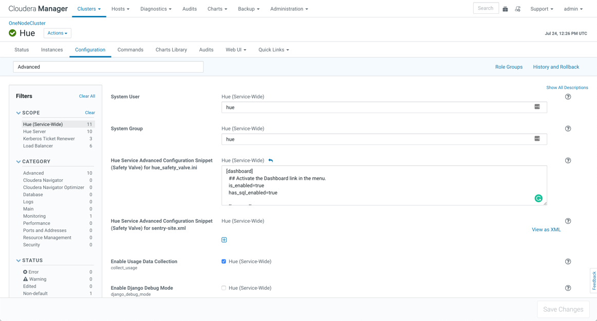

- Copy and paste the following in the text box:

   ```
     [dashboard]
       ## Activate the Dashboard link in the menu.
       is_enabled=true 
       has_sql_enabled=true
     
       [[engines]]
     
         [[[solr]]]
         ##  Requires Solr 6+
          analytics=true
          nesting=true
     
         [[[sql]]]
           analytics=true
           nesting=true
   ```

- Restart Hue for these settings to be applied. 

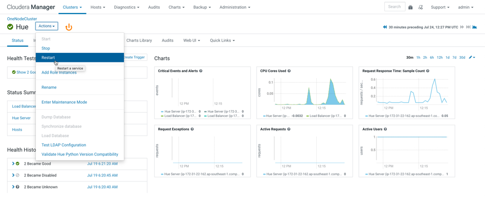

- Post restart, you would be able to see the Dashboard option in Hue. 

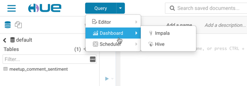

Additional details on this are available [here](http://gethue.com/how-to-configure-hue-in-your-hadoop-cluster/)

[Back to Index](#content)

--

## Build Dashboard with Hue

- You can now access the Dashboard feature to create charts and widgets using a drag and drop approach. 

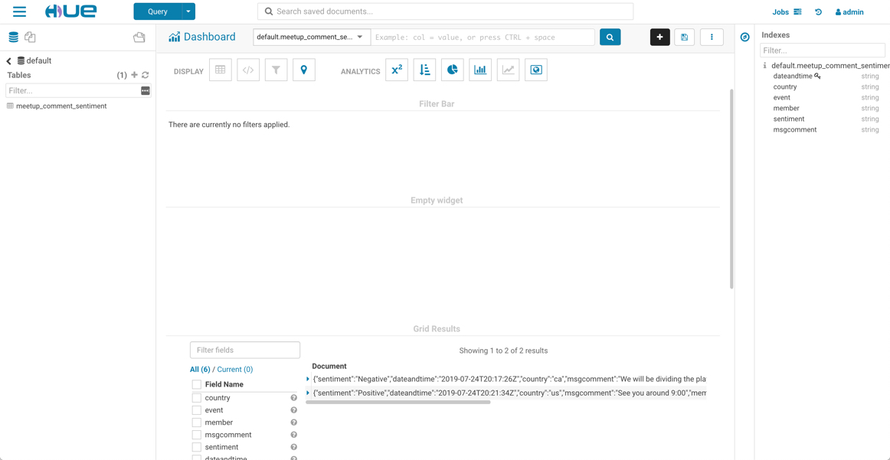

- Drag and Drop 'sentiment' into the Empty Widget

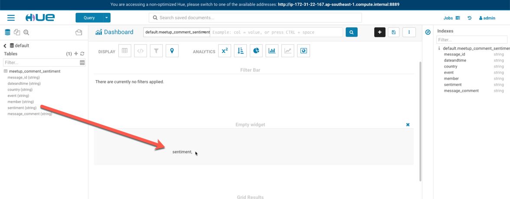

- This will automatically create a chart for you. This can further be enhanced with additional metrics, calculations and filters. 


- Drag an additional column 'country' into another area of the chart.

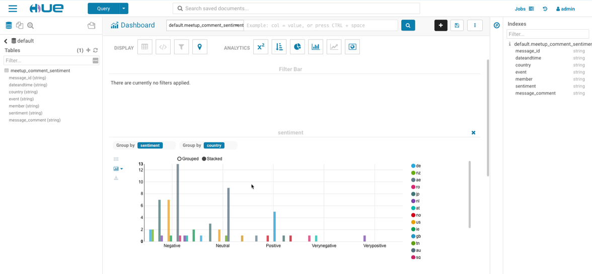

This concludes our lab. Hope you have built a better understanding of CDF and CDH through this lab and how different components work together to address a business use case. 

[Back to Index](#content)

--


​	


​	


