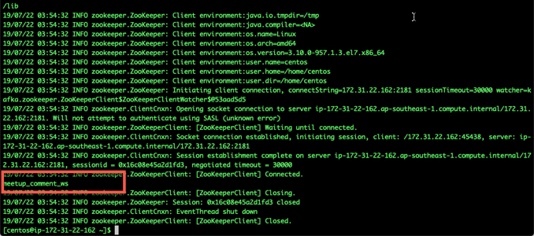
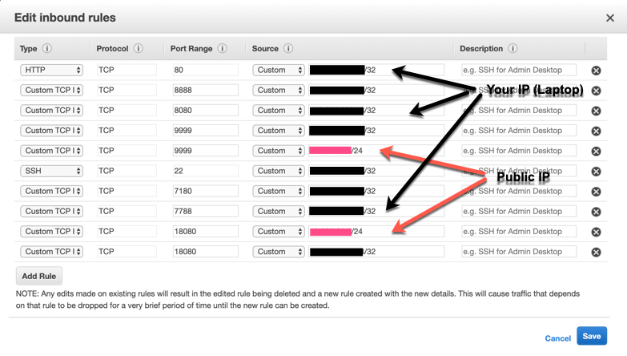
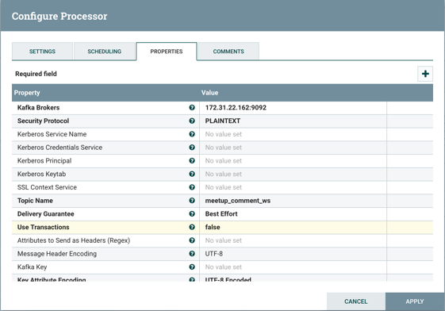
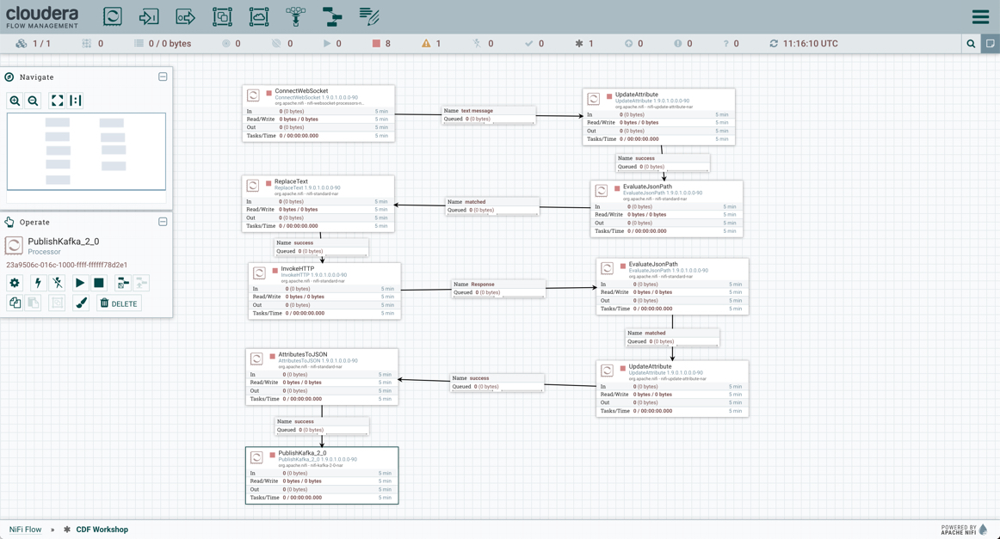
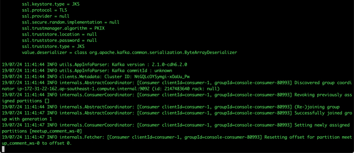
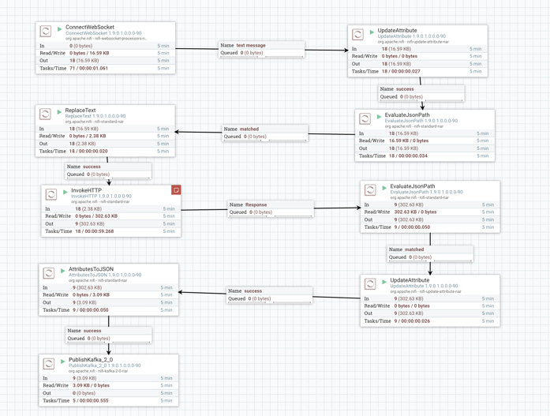
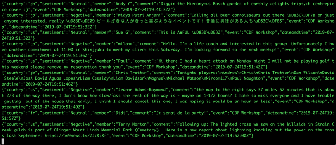
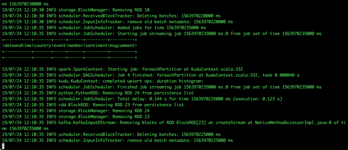

# CDF-CDH Labs: Real-time sentiment analysis with NiFi, Kafka, Spark, Python, Kudu, Impala and Hue.

--

### Objective

**The objective of this lab is to provide hands-on experience on Cloudera CDF, CDH (Kafka, Spark, Python, Kudu, Impala and Hue) through a single integrated workflow that brings all these components together in a single use-case.** 

For the purpose of this lab, we would build an end-to-end use case that will:

* *Ingest data sets from Meetup.com for a specific event through NiFi*
* *Parse the dataset and extract key terms from the data set, derive a sentiment rating with StanFord CoreNLP engine*
* *Configure NiFi with NiFi registry for Version Control*
* *Setup Kafka Topics to ingest data from NiFi*
* *Setup Kudu Tables to store the social data*
* *Leverage Spark, Python to read the data from Kafka and store it in Kudu*
* *Use Impala to run queries on Kudu*
* *Build a dashboard in Hue for better visualization of this dataset*

### Pre-requisites

You would require an environment where the following are installed and configured:

* Cloudera CDH (Impala, Kudu, Hue)
* Cloudera Data Flow (Nifi, Registry)

We provide instructions to deploy a single node CDH cluster with all the above pre-requisites configured and installed here: [Github Repo](https://github.com/fabiog1901/OneNodeCDHCluster)

Using this repo, you can bring up a CDH cluster with all components pre-installed (also includes CDSW deployment instructions as well). For specific cloudera workshops, we may provide an AMI image that can be launched without the need to install all components from scratch.

To prepare the environment:

* Deploy the OneNodeCluster using [Github Repo](https://github.com/fabiog1901/OneNodeCDHCluster). This OneNodeCluster Github repo was built by my colleague [**Fabio**](https://github.com/fabiog1901), who put in a lot of effort to have a single CDSW+CDH+CDF instance that can be leveraged for end-to-end demos and labs.  The deployment takes <30 mins for a built-from-scratch environment.

--

## Content

* [Lab 1 - Accessing the sandbox](#accessing-the-sandbox)
	* [Add an alias to your host file](#add-an-alias-to-your-hosts-file)
	* [SSH to the sandbox](#ssh-to-the-sandbox)
	* [Accessing Cloudera Manager](#accessing-cloudera-manager)
* [Lab 2 - Preparing your instance for labs](#preparing-your-instance-for-labs)
* [Lab 3 - Stream data using NiFi](#stream-data-using-nifi)
	* [Run the Sentiment Analysis Model](#run-the-sentiment-analysis-model)
	* [Build NiFi Flow](#build-nifi-flow) 
* [Lab 4 - Conifgure and explore Kafka](#configure-and-explore-kafka)
* [Lab 5 - Enhance Flow to identify sentiment on comments](#enhance-flow-to-identify-sentiment-on-comments)
* [Lab 5 - Publish Data to Kafka](#publish-data-to-kafka)
* [Lab 6 - Configure Spark and Write to Kudu](#configure-spark-and-write-to-kudu)
* [Lab 7 - Use Impala to query Kudu](#use-impala-to-query-kudu)
* [Lab 8 - Configure Hue](#configure-hue)
* [Lab 9 - Build Dashboard with Hue](#build-dashboard-with-hue)


## Accessing the sandbox

### Add an alias to your hosts file

On Mac OS X, open a terminal and vi /etc/hosts

On Windows, open C:\Windows\System32\drivers\etc\hosts

Add a new line to the existing

```xx.xx.xx.xx	demo.cloudera.com```

Replacing the ip (xx.xx.xx.xx) address with the one provided by Cloudera during the workshop. If you are launching this in your own private AWS instance, then this would be the public IP for this instance. 

### SSH to the sandbox

You would need to download the pem file, to be able to ssh to your instance. The .pem file (Mac) is available [here](https://rajat-cloudera-bigdatalab.s3-ap-southeast-1.amazonaws.com/sg-cdf-cdp-cdsw-workshop.pem) and the ppk (Windows) is [here](https://rajat-cloudera-bigdatalab.s3-ap-southeast-1.amazonaws.com/sg-cdf-cdp-cdsw-workshop.ppk)

If you are using mac, then open terminal and navigate to the directory where you have downloaded this file and execute the following:

	$ chmod 400 sg-cdf-cdp-cdsw-workshop.pem

Then you can ssh by typing (Public IP to be provided by Cloudera):

	$ ssh -i sg-cdf-cdp-cdsw-workshop.pem centos@public_ip_of_instance

On Mac use the terminal to SSH

On Windows use [putty](https://www.chiark.greenend.org.uk/~sgtatham/putty/latest.html)


[Back to Index](#content)

--

### Accessing Cloudera Manager

The following services are going to be installed, but initially only Cloudera Manager would be accessible as by default all services would be in shutdown state. 

- [Cloudera Manager](http://demo.cloudera.com:7180) : 7180
- [NiFi](http://demo.cloudera.com:8080/nifi) : 8080/nifi
- [NiFi Registry](http://demo.cloudera.com:18080/nifi-registry) : 18080/nifi-registry
- [Hue](http://demo.cloudera.com:8888) : 8888
- CDSW : cdsw.'public-ip of aws instance'.nip.io

Login to [Cloudera Manager](http://demo.cloudera.com:7180) with username/password ```admin/admin```, and familiarize yourself with all the services installed.  For the first startup, especially for CDSW, it could take up to 20 mins. 

**Note: If you are unable to modify your hosts file due to security/other concerns, then you will need to use the Amazon Public IP (provided by Cloudera) whereever you see a reference of demo.cloudera.com.**

**After a successful startup, all services would be showing a green tick.**


[Back to Index](#content)

--

## Preparing your instance for labs

There are a few configuration files and scripts that need to be downloaded in your instance, before we can start with the labs. A summary of these is as follows:

* Install Unzip
* Download Standford NLB package - [CoreNLP - Natural language software](https://stanfordnlp.github.io/CoreNLP/)
* Unzip the Stanford NLP package
* Download Kudu Spark Jar file
* Download Spark Core Jar file
* Download all scripts needed for labs and setup execute permission

The above setup has been provided in a script that you can download from here by issueing the following command in terminal/putty:

	$ wget https://raw.githubusercontent.com/rajatrakesh/CDF-CDF-Workshop/master/scripts/config_lab.sh
	$ chmod +x config_lab.sh
	$ ./config_lab.sh

This script would download/setup all the above required dependencies and will also download a bunch of housekeeping scripts that we would use during the labs. These would be available in the home folder as well. (/home/centos)

[Back to Index](#content)

--

## Stream data using NiFi

### Run the sentiment analysis model

For the purpose of this exercise we are not going to train, test and implement a classification model but re-use an existing sentiment analysis model, provided by the Stanford University as part of their 

The Stanford NLP Engine would be setup in the directory ```/home/centos/stanford-corenlp-full-2018-10-05```

To start the NLP Engine Server, execute the following script:

	$ ./start_nlp_engine.sh

**Reference:** This starts the server by executing the following command:

	cd stanford-corenlp-full-2018-10-05
	java -mx1g -cp "*" edu.stanford.nlp.pipeline.StanfordCoreNLPServer -port 9999 -timeout 15000 </dev/null &>/dev/null &


Details on the corenlp server are available here [Stanford NLP](https://stanfordnlp.github.io/CoreNLP/corenlp-server.html)

The script ```1_start_nlp.sh``` will run in the background on port 9999 and you can visit the [NLP Engine](http://demo.cloudera.com:9999/) to make sure it's running.


To test out the engine, remove all annotations and use **Sentiment** only. 

The model will classify the given text into 5 categories:

- very negative
- negative
- neutral
- positive
- very positive

[Back to Index](#content)

--

### Build NiFi flow

In order to have a streaming source available for our workshop, we are going to make use of the publicly available Meetup.com API and connect to their WebSocket.

The API documentation is available [here](https://www.meetup.com/meetup_api/docs/stream/2/event_comments/#websockets).

In this scenario we are going to stream all comments, for all topics, into NiFi and classify each one of them into the 5 categories listed above. 

To do that we need to score each comment's content against the Stanford CoreNLP's sentiment model. 

In real-world use case we would probably filter by event of our interest but for the sake of this workshop we won't and assume all comments are given for the same event: the famous CDF workshop!

Let's get started... Open [NiFi UI](http://demo.cloudera.com:9090/nifi/) and follow the steps below:

- **Step 1: Adding a Processor Group**
	- Drag the Processor Group to the Canvas and give it a name 'CDF Workshop'. 
	- Click Add.
	- Double click the Processor Group and it will show up a blank canvas (inside the group).

	

- **Step 2: Enabling Nifi Registry**
	- Open the [Nifi Registry portal](http://demo.cloudera.com:18080/nifi-registry)
	
	
	
	- Let's add a bucket. Click the wrench icon in the right corner to open up the Bucket screen.
	- Let's create a new bucket and call it ```workshop```.
	
	

	- We need to connect Nifi with Nifi Registry. Click the three hortizontal bar icon in the right top corner. Then click 'Controller Settigs'
	
	
	
	- Let's create a new registration for the client. **Note For this option to work, you would need to open the port 18080, to not just your public IP (computer), but also the public IP of your instance.**

	
	
	- Add the url of Nifi Registry and click update.
	
	
	
	- Right click anywhere on the Nifi canvas and select 'Refresh' in the menu.
	- Right click again and this time select 'Version' -> 'Start Version Control'.
	
	
	
	- If everything is setup correctly, your bucket created earlier should get autoselected (being the only bucket).
	- Provide a name for the Flow - ```CDF Workshop``` for example. 
	- You can also provide a description for your flow. 
	- Click Save.
	
	
	
	- A green tick will appear on your Processor Group indicating that your flow now has versipon control enabled. 
	
	

- **Step 3: Add a ConnectWebSocket processor to the canvas**
 	 - Double click on the processor
 	 - On settings tab, check all relationships except **text message**, as we want only a text message to go forward to subsequent flow. 
 	 
 	 
 	 
 	 - Got to properties tab and select or create **JettyWebSocketClient** as the WebSocket Client Controller Service
 	 - Go to properties tab and give a value to **WebSocket Client Id** such as ```demo``` for example
 	 
 	   
 	 
 	 - Then configure the service (click on the arrow on the right)
 	 - Go to properties tab and add this value: ```ws://stream.meetup.com/2/event_comments``` to property **WebSocket URI**
 	 - Apply the change
 	 - Enable the controller service (click on the thunder icon) and close the window
 	 - Apply changes
 	 
 	  
 	 
- **Step 4: Add an UpdateAttribute connector to the canvas**
	- Double click to open the processor. 
	- On properties tab add new property mime.type clicking on + icon and give the value ```application/json```. This will tell the next processor that the messages sent by the Meetup WebSocket is in JSON format.
	- Add another property ```event``` and give it a value ```CDF workshop``` for the purpose of this exercise.
	- Apply changes.
	
	

- **Step 5: Link ConnectWebSocket with UpdataAttribute processor**
	- Hover the mouse on the **ConnectWebSocket** processor and a link icon will appear
	
	 
	
	- Drag and link this to the **UpdateAttribute** processor (green link will appear)
	
	
	
	- A property box will open up. 
	- Select only **text message**
	
	
	
	- The two processors are now linked
	
	

- **Step 6: Add EvaluateJsonPath processor to the canvas**
	- Double click the processor.
	- On Settings tab, select both **failure** and **unmatached** relationships
	- On properties tab, change **Destination** value to **flowfile-attribute**.
	- Add the following properties:
		- timestamp: ```$.mtime```
		- member: ```$.member.member_name```
		- country: ```$.group.country```
		- comment: ```$.comment```
	- The message coming out of the processor would look like this:

	```json
	{"visibility":"public","member":{"member_id":11643711,"photo":"https:\/\/secure.meetupstatic.com\/photos\/member\/3\/1\/6\/8\/thumb_273072648.jpeg","member_name":"Loka Murphy"},"comment":"I didn’t when I registered but now thinking I want to try and get one since it’s only taking place once.","id":-259414201,"mtime":1541557753087,"event":{"event_name":"Tunnel to Viaduct 8k Run","event_id":"256109695"},"table_name":"event_comment","group":{"join_mode":"open","country":"us","city":"Seattle","name":"Seattle Green Lake Running Group","group_lon":-122.34,"id":1608555,"state":"WA","urlname":"Seattle-Greenlake-Running-Group","category":{"name":"fitness","id":9,"shortname":"fitness"},"group_photo":{"highres_link":"https:\/\/secure.meetupstatic.com\/photos\/event\/9\/e\/f\/4\/highres_465640692.jpeg","photo_link":"https:\/\/secure.meetupstatic.com\/photos\/event\/9\/e\/f\/4\/600_465640692.jpeg","photo_id":465640692,"thumb_link":"https:\/\/secure.meetupstatic.com\/photos\/event\/9\/e\/f\/4\/thumb_465640692.jpeg"},"group_lat":47.61},"in_reply_to":496130460,"status":"active"}```
	- Link EvaluateJsonPath to UpdateAttribute processor 

- **Step 7: Add a AttributesToCSV processor to the canvas**
	- Double click to open the processor. 
	- On settings tab, select **failure** relationship
	- Change **Destination** value to **flowfile-content**
	- Change **Attribute List** value to write only the above parsed attributes: **timestamp,event,member,country,comment**
	- Set **Include Schema** to **true**
	- Apply changes
	- Link AttributesToCSV with EvaluateJsonPath on **matched** relationship

- **Step 8: Add a PutFile processor to the canvas**
	- Open the processor.
	- On settings tab, select **all** relationships - Since this will be the last connector in this flow, we need to terminate all relationships. 
	- Change **Directory** value to ```/tmp/workshop```
	- Link PutFile process with AttributesToCSV processor on **success** relationship.
	- Apply Changes.

- **Step 9: Commit your first Flow**
	- Right click anywhere on the canvas.
	- Click 'Version' -> 'Commit Local Changes'.
	
	.
	
	- Provide commentary for your Version.
	
	.
	
	- Now goto Nifi Registry and you would be able to see the version information show up here as well. 
	
	.

- **Step 10: Start your First Flow**
	- Click the Play icon on the 'CDF Workshop' Processor Group to start the entire flow. 
	- All the processors will now show a green play icon, as the processor start to execute. 
	- You will see flow-files starting to move and you can gradually see how the data is being read from meetup.com
	
	.
	
	- To review the actual files being written, ssh to your instance and navigate to the ```/tmp/workshop``` directory.
	- You will see all the files being written here. You can select any one of them and issue a ```cat <filename>``` command to view the contents as well. 
	
	.
	
	- Once done, stop the flow and delete the files created by this flow by typing:
		
		```sudo rm -rf /tmp/workshop/*```

[Back to Index](#content)

--
## Configure and Explore Kafka

- **Setup Kafka Topic**
	- SSH to your instance. 
	- Normally, you would need to identify where kafka is installed and then execute a bunch of command line statements to create & list topics. There is a seperate utility for tracking what content is being written in Kafka. For this lab, we have parameterized these statements and provided them via scripts, making it easy to setup the lab.
	- **Note While all scripts are parameterized, if you need a scirpt to find out your public/private ip of your instance or the kafka installation diretory, then you case use the 'set_env.sh' script for reference.**
	
	- List Kafka Topics by executing the following:
	
		```$ ./list_kafka_topics.sh```
		
	- By default, your environment will not have any existing Kafka topics setup, hence no topics will be displayed. 
	- Let's create a Kafka Topic ```meetup_comment_ws``` by executing the following:
	
		```$ ./create_kafka_topic.sh meetup_comment_ws```
		
	- Let's check if the topic has been created by executing:
	
		```$ ./list_kafka_topics.sh```
	
	.
	
[Back to Index](#content)

--

## Enhance Flow to identify sentiment on comments

Go back to [NiFi UI](http://demo.cloudera.com:9090/nifi/) and follow the steps below:

- **Step 1: Remove EvaluateJson and AttributesToCSV processorsw**
  - Right click on the relationship between EvaluateJsonPath and AttibutesToCSV processors and delete
  - Delete the AttibutesToCSV processor
  - Do the same for the PutFile processor
  
- **Step 2: Parse content through the sentiment engine to derive sentiment**
  - Add ReplaceText processor and link from EvaluateJSonPath on **matched** relationship
  - Double click on processor and check **failure** on settings tab
  - Go to properties tab and remove value for **Search Value** and set it to empty string
  - Set **Replacement Value** with value: ```${comment:replaceAll('\\.', ';')}```. We want to make sure the entire comment is evaluated as one sentence instead of one evaluation per sentence within the same comment.
  - Set **Replacement Strategy** to **Always Replace**
  - Apply changes


  
- **Step 3: Invoke the Sentiment engine through InvokeHTTP processor**
  - Add InvokeHTTP processor and link from ReplaceText on **success** relationship
  - Double click on processor and check all relationships except **Response** on settings tab
  - Go to properties tab and set value for **HTTP Method** to **POST**
  - Set **Remote URL** with value: ```http://yourpublicip:9999/?properties=%7B%22annotators%22%3A%22sentiment%22%2C%22outputFormat%22%3A%22json%22%7D``` which is the url encoded value for ```http://yourpublicip:9999/?properties={"annotators":"sentiment","outputFormat":"json"}```
  - **Make sure you have used the encoded URL and that you have replaced 'yourpublicip' with your actual IP**
  - Set **Content-Type** to ```application/x-www-form-urlencoded```
  - Apply changes


**Important: In case you experience issues with this processor (during execution), you may need to open the port 9999 in your security groups since you are accessing this service. Your AWS security group would look something like below:


  
- **Step 4: Add EvalueJsonPath processor to process sentiment**
  - Add EvaluateJsonPath to the canvas and link from InvokeHTTP on **Response** relationship
  - Double click on the processor
  - On settings tab, check both **failure** and **unmatched** relationships
  - On properties tab
  - Change **Destination** value to **flowfile-attribute**
  - Add on the property **sentiment** with value ```$.sentences[0].sentiment```
  - Apply changes


  
- **Step 5: Format time [ISO format](https://en.wikipedia.org/wiki/ISO_8601) with UpdateAttribute processor (future use for time based analytics)**
  - Add UpdateAttribute processor and link from EvaluateJsonPath on **matched** relationship
  - Using handy [NiFi's language expression](https://nifi.apache.org/docs/nifi-docs/html/expression-language-guide.html#dates), add a new attribue ```dateandtime``` with value: ```${timestamp:format("yyyy-MM-dd'T'HH:mm:ss'Z'", "Asia/Singapore")}``` to properties tab


- **Step 6: Prepare attributes list that will be pushed to Kafka with AttributesToJSON processor**
  - Add AttributesToJSON Processor.
  - Link with UpdateAttribute on **success**.
  - Double click on processor
  - On settings tab, check **failure** relationship
  - Go to properties tab
  - In the Attributes List value set ```dateandtime, country, event, member, sentiment, comment```. We will match this structure later in the table that we will create in Kudu.
  - Change Destination to **flowfile-content**
  - Set Include Core Attributes to **false**
  - Apply changes


  
- **Step 7: Push the data to Kafka with PublishKafka_2 _0 connector**
  - Add PublishKafka_2 _0 to the canvas and link from AttributesToJSON on **success** relationship
  - Double click on the processor
  - On settings tab, check all relationships as this is a the last step.
  - On properties tab
  - Change **Kafka Brokers** value to ```yourlocalip:9092``` (make sure you select your local ip of the instance as kafka will be listening on that. If you are unsure of what is the local ip, you can execute the following:
  
  		```$ ./show_env.sh```
  
  - Change **Topic Name** value to ```meetup_comment_ws```
  - Change **Use Transactions** value to **false**
  - Apply changes.


 
  - CDF Flow is now ready and should look like the following:



[Back to Index](#content)

--

## Configure Kudu and Impala

We will now setup a Kudu table with the same schema that we are using in Step 6 above. The steps are as follows:

- Connect to Hue. We will be using Hue as our query client to create and access table, with Impala. To connect to Hue, click the [Hue](demo.cloudera.com:8888) URL.
- **Important: Since we would be accessing Hue for the first time, the first user to access it will become the Hue Admin**


- Let's use admin/admin as the userid/password for Hue.
- Before you create the tables, confirm that Kudu service is running (using Cloudera Manager)


- Execute the following query in the Impala query console

		CREATE TABLE meetup_comment_sentiment
		(
		dateandtime string,
		country string,
		event string,
		member string,
		sentiment string,
		msgcomment string,
		 PRIMARY KEY (dateandtime)
		)
		PARTITION BY HASH PARTITIONS 10
		STORED AS KUDU
		TBLPROPERTIES ('kudu.num_tablet_replicas' = '1');

- Click the blue 'Play' button on the left. You will get a confirmation that the table has been created. 


[Back to Index](#content)

--
## Publish Data to Kafka

- Before we start pushing the data into Kafka, let's start the Kafka Consumer to see what is coming through CDF (live).
- To start Kafka Consumer, execute the following script in terminal:

		$./kafka_console.sh meetup_comment_ws

- Kafka will start and your screen will show something similar to below:



- Let's start our CDF flow by clicking the Play button on the CDF Workshop group. 

- You will see the Nifi Flow working. You will see the messages going in and you will be able to see it change if you right click and refresh. 



- And messaged would start showing up in the Kafka Console Window:



- You can either keep both Kafka and CDF Flow running till you have 50-100 messages and then stop the CDF Flow by click the 'Stop' button on the 'CDF Workshop' Processor Group.

[Back to Index](#content)

--

## Configure Spark and Write to Kudu

- We will be using Spark to execute the following script which will 
	- Read data from Kakfa Topic
	- Write this data to Kudu Table we created
- To execute the Spark process, type the following:

		$ ./spark_kudu.sh
	
- This executes the following command line:

		spark-submit --master local[2] --jars kudu-spark2_2.11-1.9.0.jar,spark-core_2.11-1.5.2.logging.jar --packages org.apache.spark:spark-streaming-kafka_2.11:1.6.3 spark_kudu.py
		
- The pySpark code is available in the scripts directory [here](./scripts/spark_kudu.py)

- On execution, the spark job will start and the data will start showing up in Kudu. 



- We will check the data being written by Spark by using Hue, in the next segment.

[Back to Index](#content)

--

## Use Impala to query Kudu

- With the spark job running, let's validate that data is being written to our Kudu table. 
- Access Hue and navigate to the Impala Query. 
- Execute the following query: 

		select count(*) from meetup_comment_sentiment;
		
- If you execute this query a few times, you would be able to see records getting populated into your table. 


- Let's also check the values of columns. For this, we advise that you use a ```limit``` parameter, if executing a ```select *``` statement, as follows:

		select * from meetup_comment_sentiment limit 10;


- We can see that data is coming in all the columns that we had setup. 

[Back to Index](#content)

--

## Configure Hue

- The last thing that remains is to Build a Dashboard on the data that we have ingested. There is a small configuration that we need to do for enabling the inbuilt dashboard capability that Hue has. By default this is disabled, as this is typically leveraged with Solr. 

- To enable this functionality, open Cloudera Manager. Click Hue.

- Then on the Hue screen, select 'Configuration' tab. On the configuration tab, search for the property Hue Safety Valve under Hue Service → Configuration → Service-Wide → Advanced → Hue Service Advanced Configuration Snippet (Safety Valve) for hue_safety_valve.ini


- Copy and paste the following in the text box:

		[dashboard]
		  ## Activate the Dashboard link in the menu.
		  is_enabled=true 
		  has_sql_enabled=true
		
		  [[engines]]
		
		    [[[solr]]]
		    ##  Requires Solr 6+
		     analytics=true
		     nesting=true
		
		    [[[sql]]]
		      analytics=true
		      nesting=true

- Restart Hue for these settings to be applied. 


- Post restart, you would be able to see the Dashboard option in Hue. 


Additional details on this are available [here](http://gethue.com/how-to-configure-hue-in-your-hadoop-cluster/)

[Back to Index](#content)

--

## Build Dashboard with Hue

- You can now access the Dashboard feature to create charts and widgets using a drag and drop approach. 


- Drag and Drop 'sentiment' into the Empty Widget


- This will automatically create a chart for you. This can further be enhanced with additional metrics, calculations and filters. 


- Drag an additional column 'country' into another area of the chart.


This concludes our lab. Hope you have built a better understanding of CDF and CDH through this lab and how different components work together to address a business use case. 

[Back to Index](#content)

--


	


	


